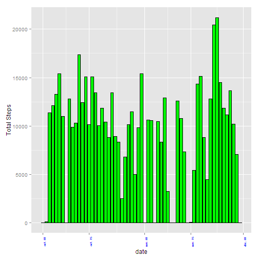
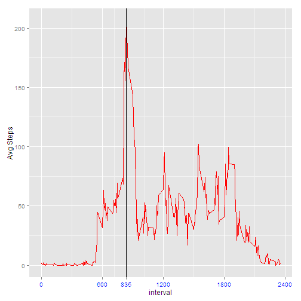
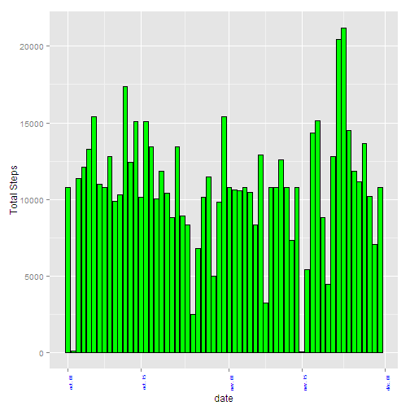
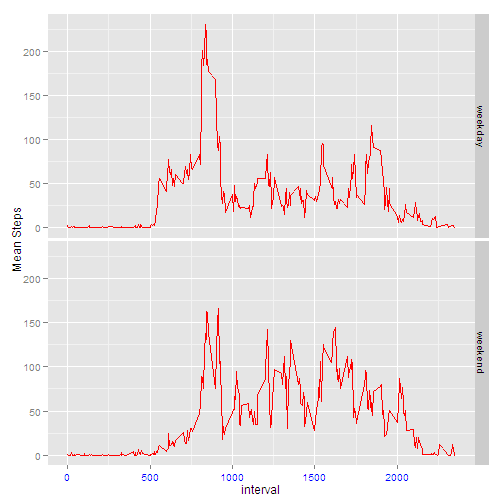

## Loading and preprocessing the data
We assume that the *activity.csv* file is in the R working directory

### Load the data
Read the csv file

```r
activity<-read.csv("activity.csv")
```
### Preprocess the data
Convert the date column from factor type to a date type

```r
activity$date<-as.Date(activity$date)
```

## What is mean total number of steps taken per day?
The NA value are ignored in the dataset

### Make a histogram of the total number of steps taken each day

We use the plyr library to make the sum of the steps for each day with the ddply function

```r
library(plyr)
totalStepPerDay<-ddply(activity,c("date"),summarize,sum=sum(steps, na.rm=T))
```

Then, we build the histogram with the ggplot function

```r
library(ggplot2)
ggplot(totalStepPerDay, aes(date, sum)) + geom_bar(stat = "identity", fill = "green", color="black") + theme(axis.text.x= element_text(angle=90, size=6, color="blue")) + ylab("Total Steps")
```

 


### Calculate and report the mean and median total number of steps taken per day
Mean computation is like that:

```r
mean(totalStepPerDay$sum)
```

```
## [1] 9354.23
```
Median computation is like that:

```r
median(totalStepPerDay$sum)
```

```
## [1] 10395
```

## What is the average daily activity pattern?

1. Make a time series plot (i.e. type = "l") of the 5-minute interval (x-axis) and the average number of steps taken, averaged across all days (y-axis)

2. Which 5-minute interval, on average across all the days in the dataset, contains the maximum number of steps

First , we use the plyr function to make the mean of the total number steps for each interval 

```r
intervalData<-ddply(activity,c("interval"),summarize,mean=mean(steps, na.rm=T))
```

Then we plot the graph between interval and average number of steps and we put a line
in the graph for maximum number of steps for 5 min interval
The function scale_x_continuous is used to display the interval number where the  
maximum number of steps is reached.

```r
ggplot(intervalData, aes(interval, mean)) + geom_line(stat = "identity", fill = "orange", color="red") + theme(axis.text.x = element_text(size=10, color="blue")) + ylab("Avg Steps") + geom_vline(xintercept = intervalData$interval[intervalData$mean ==max(intervalData$mean)]) + scale_x_continuous(breaks = c(0,600,intervalData$interval[intervalData$mean ==max(intervalData$mean)],1200,1800,2400))
```

 

As seen in the graph, the interval number where the maximum number of steps is reached:

```r
intervalData$interval[intervalData$mean ==max(intervalData$mean)]
```

```
## [1] 835
```


## Imputing missing values

Here is the code to calculate and report the total number of missing values in the dataset (i.e. the total number of rows with NAs)

```r
sum(is.na(activity$steps))
```

```
## [1] 2304
```

Then,  we copy activity data to new variable and substituted the NAs values with mean number of steps for given interval (it was calculated earlier)


```r
modifiedActivity<-activity
for (i in 1:nrow(modifiedActivity)) 
{
        if(is.na(modifiedActivity$steps[i])){
                modifiedActivity$steps[i] <- intervalData[intervalData$interval==modifiedActivity$interval[i],]$mean
        }
}
```

Make the sum of the steps for each day with the data without NA values


```r
totalStepPerDayWithoutNA<-ddply(modifiedActivity,c("date"),summarize,sum=sum(steps, na.rm=T))
```

Display the histogram:


```r
ggplot(totalStepPerDayWithoutNA, aes(date, sum)) + geom_bar(stat = "identity", fill = "green", color="black") + theme(axis.text.x= element_text(angle=90, size=6, color="blue")) + ylab("Total Steps")
```

 

Mean computation is like that:

```r
mean(totalStepPerDayWithoutNA$sum)
```

```
## [1] 10766.19
```
Median computation is like that:

```r
median(totalStepPerDayWithoutNA$sum)
```

```
## [1] 10766.19
```

Do these values differ from the estimates from the first part of the assignment?
The values differs a little.

What is the impact of imputing missing data on the estimates of the total daily number of steps?
The histogram has the same look and feel as the first part of the assignement, but it gives a better tendency of the value variation.

## Are there differences in activity patterns between weekdays and weekends?
Create a new factor variable in the dataset with two levels - "weekday" and "weekend" indicating whether a given date is a weekday or weekend day.

We use the English time to be able to recognize the days of the vector

```r
Sys.setlocale("LC_TIME", "English")
```

```
## [1] "English_United States.1252"
```

```r
wdays<-c("Monday","Tuesday","Wednesday","Thursday","Friday")

modifiedActivity$day<-as.factor(ifelse(weekdays(modifiedActivity$date)%in%wdays,"weekday","weekend"))
```
Make a panel plot containing a time series plot (i.e. type = "l") of the 5-minute interval (x-axis) and the average number of steps taken, averaged across all weekday days or weekend days (y-axis).

Calculate the mean of the steps by interval and by weekday or weekend:

```r
weekData<-ddply(modifiedActivity,c("interval","day"),summarize,mean=mean(steps, na.rm=T))
```

Create the graph with ggplot:

```r
 ggplot(weekData, aes(interval, mean)) + geom_line(stat = "identity", fill = "orange", color="red") + theme(axis.text.x = element_text(size=10, color="blue")) + ylab("Mean Steps") + facet_grid(day~.)
```

 
